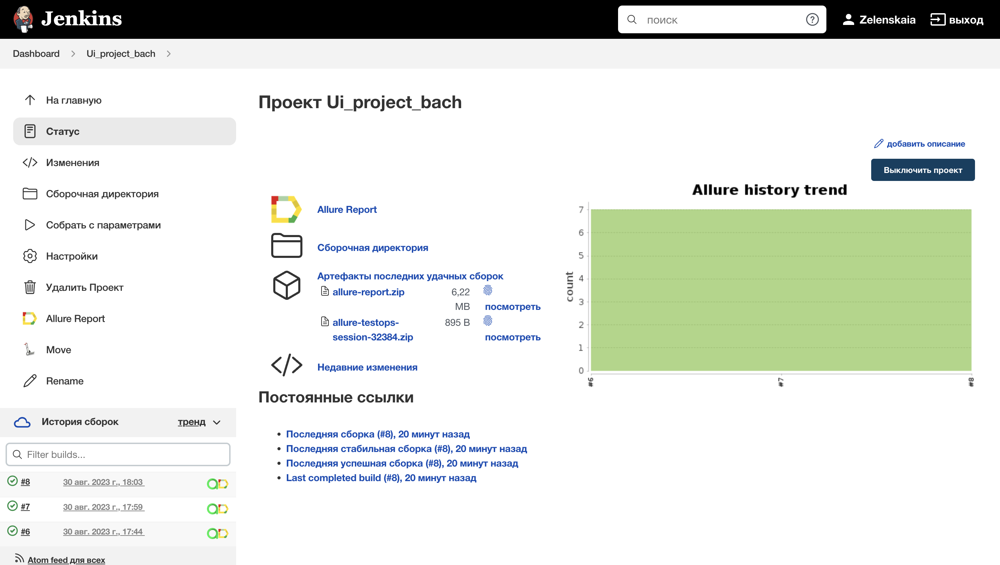
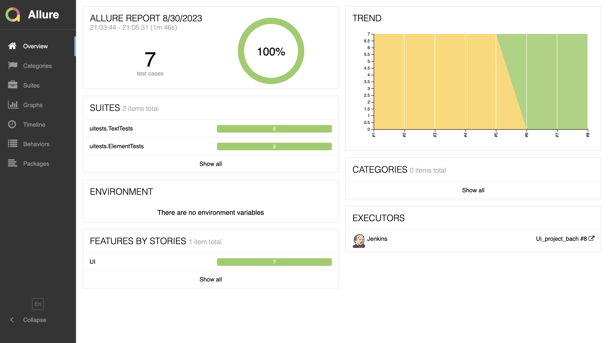
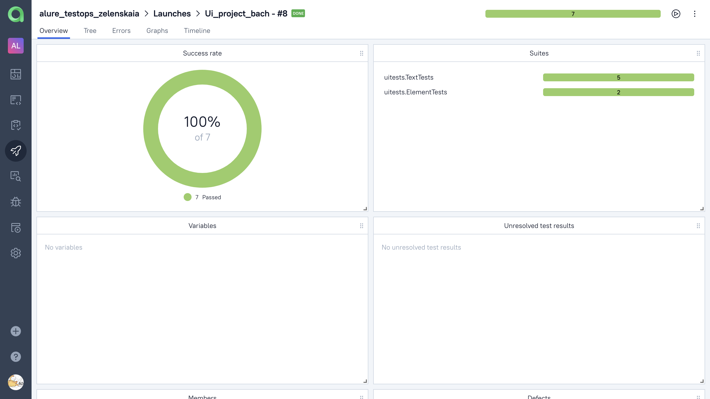
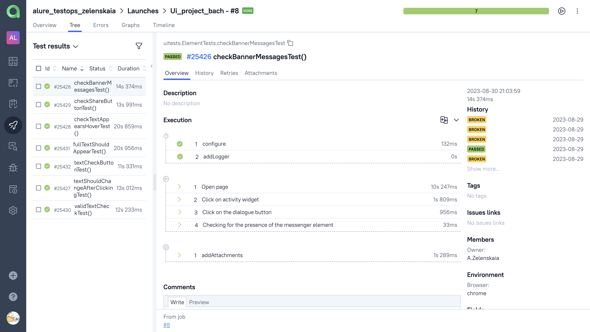
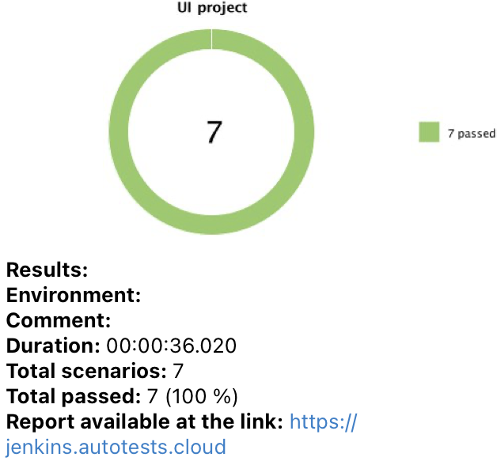

<h1>
Diploma project on automated testing of thebach.com website <a                                   href="https://www.thebach.com/">thebach.com</a></h1>


## :bookmark_tabs: Content 
- <a href="#tools">Stack of technologies</a>
- <a href="#tests">List of checks</a>
- <a href="#run">Running tests from the terminal</a>
- <a href="#remote">Remote running tests</a>
- <a href="#jenkins-report">Running tests in Jenkins</a>
- <a href="#allure-report">Test results report in Allure Report</a>
- <a href="#allure-testops">Integration with Allure TestOps</a>
- <a href="#telegram">Integration with Telegram</a>

<a id="tools"></a>
## :computer: Stack of technologies
<code></code>
<code></code>
<code></code>
<code></code>
<code></code>
<code></code>
<code></code>
<code></code>
<code></code>
<code></code>
</p>

## Checks carried out:

- [x] Checking the display of buttons
- [x] Checking the correctness of the text display
- [x] Checking whether the popup is displayed
- [x] Set зredictive сheck 

 
 <a id="console"></a>
## :computer: Running tests from the terminal
### Running tests locally

```
gradle clean test 
```

### Remote test run

```
gradle clean test 
"-Dbrowser=${browser}" 
"-DbrowserVersion=${browserVersion}" 
"-DbrowserSize=${browserSize}" 
"-DremoteUrl=${remoteUrl}"
"-DisRemote=true"
```

<a id="jenkins-report"></a>
##  Running tests in [Jenkins](https://jenkins.autotests.cloud/job/Ui_project_bach/)

To start the assembly, you need to go to the section <code><strong>*Собрать с параметрами*</strong></code> 
and click on <code><strong>*Собрать*</strong></code>.

<p align="center">
  
</p>

<a id="allure-report"></a>
##  Test results report in [Allure Report](https://jenkins.autotests.cloud/job/Ui_project_bach/8/allure/)

With <code><strong>Jenkins</strong></code> reports are generated in <code><strong>Allure</strong></code>

<p align="center">
  
</p>

<a id="allure-testops"></a>
##  Integration with [Allure TestOps](https://allure.autotests.cloud/launch/29295)

<p align="center">
  
</p>

### Test-cases

<p align="center">
  
</p>

<a id="telegram"></a>
##  Telegram notifications using a bot
After passing all the tests, an automatic report is sent to the <code>Telegram</code> messenger

<p align="center">

</p>


